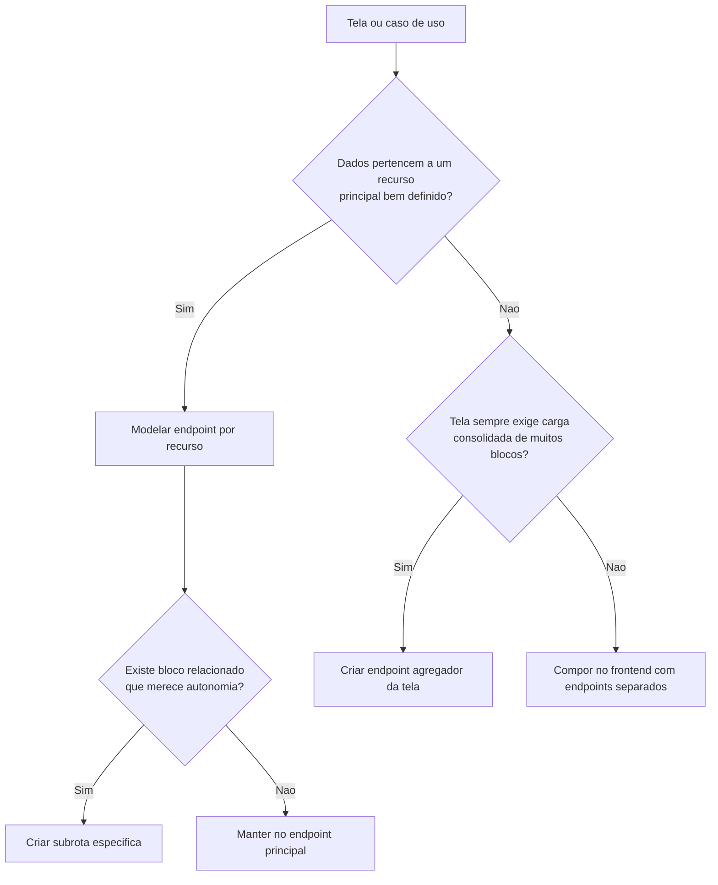

# API REST

## Direcao inicial

A API sera uma aplicacao `NestJS` separada, orientada a recursos, com versionamento por prefixo e contratos explicitos entre `front` e `back`.

Prefixo inicial sugerido:

```text
/api/v1
```

## Recursos previstos

- `/auth`
- `/users`
- `/teams`
- `/stores`
- `/customers`
- `/leads`
- `/negotiations`
- `/dashboards`
- `/audit-logs`

## Regras operacionais

- JWT obrigatorio para rotas protegidas.
- RBAC aplicado no backend conforme papel do usuario.
- Escopo organizacional resolvido no backend com base nos vinculos multi-team do utilizador.
- Filtros temporais validados no servidor.
- Logs de acesso e operacoes com data, hora e usuario responsavel.
- Comunicacao com o frontend exclusivamente por `HTTP/JSON`.

## Convencoes propostas

- Respostas com payload consistente e codigos HTTP semanticos.
- Erros de dominio desacoplados da tecnologia de transporte.
- Paginacao e filtros sempre explicitos em query params.
- Recursos analiticos separados dos recursos transacionais quando necessario.
- Controllers do Nest funcionando apenas como adaptacao HTTP, sem concentrar regra de negocio.
- Decorators do Nest usados para roteamento, documentacao e composicao dos contratos da API.
- Swagger disponivel para documentacao tecnica inicial da API.

## Contrato atual de usuario

O recurso `users` esta em transicao de contrato.

Campos canonicos de organizacao:

- `memberTeamIds`
- `managedTeamIds`

Campo legado ainda exposto:

- `teamId`

Regra de compatibilidade:

- `teamId` continua no payload para nao quebrar consumidores antigos;
- ele deve ser tratado como `deprecated`;
- novos consumidores devem usar os arrays multi-team;
- o backend nao deve voltar a depender de `teamId` como fonte de verdade para autorizacao.

Camada administrativa adicional do contrato:

- `accessGroupId`
- `accessGroup`

Esses campos representam grupos administrativos e feature toggles, sem substituir `role`.

## Estado atual da Sprint 1

- `teams` possui CRUD inicial administrativo com `POST`, `GET`, `GET :id`, `PATCH :id` e `DELETE :id`.
- `stores` possui CRUD inicial administrativo com `POST`, `GET`, `GET :id`, `PATCH :id` e `DELETE :id` (JWT; papeis `ADMINISTRATOR` e `GENERAL_MANAGER`).
- Os endpoints de `PATCH` em `teams` e `stores` aceitam atualizacao parcial e retornam `400` quando nenhum campo e enviado.
- `teams` valida previamente `managerId` e `storeId`, aceitando apenas usuarios com papel compativel com gerencia e lojas existentes para fechar o vinculo organizacional basico.
- `stores` retorna conflito de negocio ao tentar excluir loja ainda vinculada a leads.
- `users` ja devolve `memberTeamIds`, `managedTeamIds`, `accessGroupId` e `accessGroup`.
- `users.teamId` permanece apenas como compatibilidade de transicao.
- `leads` e `teams` ja operam com RBAC baseado em escopo multi-team no backend.

## Proximos passos

### Regra de decisão

| Cenário | Estratégia |
| --- | --- |
| CRUD e telas simples | Endpoints por recurso |
| Recurso principal com dados auxiliares independentes | Recurso principal + subrotas |
| Dashboard e visão consolidada | Endpoint agregador por tela |
| Detalhe muito complexo e sempre carregado em bloco | Endpoint de composição específico, se justificado |



### Decisão atual do projeto

- `auth`, `users`, `teams`, `stores`, `customers` e `leads` seguem desenho por recurso.

#### Leads — listagem consumida pelo frontend (Sprint 1)

Rotas em `/app/leads` (autenticação obrigatória, envelope de sucesso habitual). O escopo efetivo segue `LeadAccessPolicy` no backend (equipas membro/gestor via `memberTeamIds` / `managedTeamIds`; `teamId` no DTO do utilizador é legado/compatibilidade).

| Método | Caminho | Uso na UI |
| --- | --- | --- |
| `GET` | `/api/leads/owner/:ownerUserId?page=&limit=` | Atendente: próprio `id`. Gestores: owners no mesmo escopo de equipas. Resposta paginada (`data.items`, `total`, até 10 por página). |
| `GET` | `/api/leads/manager?page=&limit=` | `MANAGER`: listagem unificada do escopo (membro ∪ equipas geridas). |
| `GET` | `/api/leads/team/:teamId?page=&limit=` | `teamId` nas equipas legíveis; resposta paginada. |
| `GET` | `/api/leads/all?page=&limit=` | `ADMINISTRATOR` e `GENERAL_MANAGER`: listagem global paginada. |

Corpo de `data`: objeto com `items` (cada lead: `id`, `customerId`, `storeId`, `ownerUserId`, `source`, `status`), `page`, `limit`, `total`, `totalPages` (ver Swagger / `LeadResponseDto` para cada item).

- `dashboards` podem e devem ter endpoints agregadores por tela.
- o detalhe de lead deve começar simples, com recurso principal e subrotas como histórico; só deve ganhar endpoint de composição se houver ganho real de desempenho e simplicidade.
- a API não deve nascer acoplada à UI inteira; agregação é exceção consciente, não regra padrão.

1. Definir contratos mínimos da Sprint 1.
2. Criar documentação de endpoints por módulo.
3. Padronizar formato de erro e metadados de paginação.
