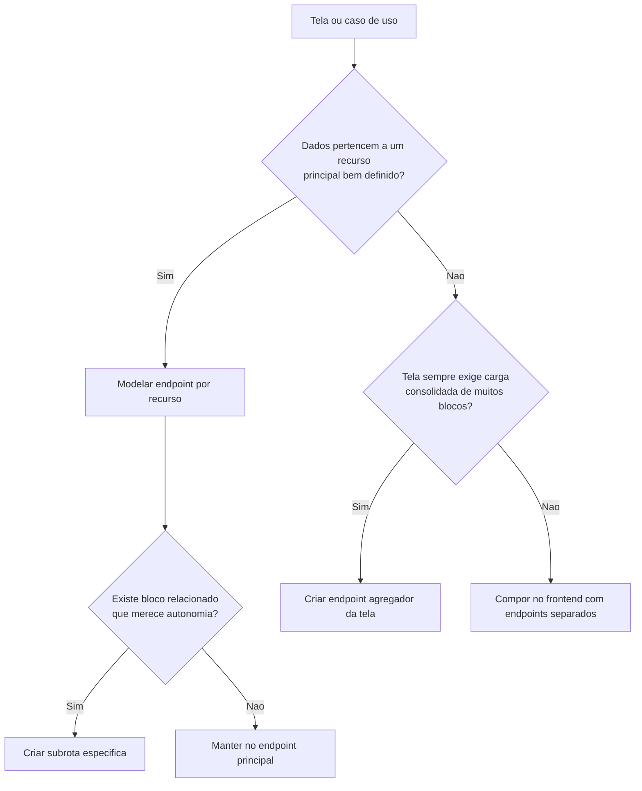

# API REST

## Direção inicial

A API será uma aplicação `NestJS` separada, orientada a recursos, com versionamento por prefixo e contratos explícitos entre `front` e `back`.

Prefixo inicial sugerido:

```text
/api/v1
```

## Recursos previstos

- `/auth`
- `/users`
- `/teams`
- `/stores`
- `/customers`
- `/leads`
- `/negotiations`
- `/dashboards`
- `/audit-logs`

## Regras operacionais

- JWT obrigatório para rotas protegidas.
- RBAC aplicado no backend conforme papel do usuário.
- Filtros temporais validados no servidor.
- Logs de acesso e operações com data, hora e usuário responsável.
- Comunicação com o frontend exclusivamente por `HTTP/JSON`.

## Convenções propostas

- Respostas com payload consistente e códigos HTTP semânticos.
- Erros de domínio desacoplados da tecnologia de transporte.
- Paginação e filtros sempre explícitos em query params.
- Recursos analíticos separados dos recursos transacionais quando necessário.
- Controllers do Nest funcionando apenas como adaptação HTTP, sem concentrar regra de negócio.
- Decorators do Nest usados para roteamento, documentação e composição dos contratos da API.
- Swagger disponível para documentação técnica inicial da API.

## Estratégia de desenho dos endpoints

A API deve seguir orientação por recurso como padrão. Isso significa:

- endpoints separados por domínio e responsabilidade;
- subrotas quando a relação entre recurso principal e bloco derivado for clara;
- endpoint agregador apenas para telas que sempre precisem de muitos blocos juntos.

### Regra de decisão

| Cenário | Estratégia |
| --- | --- |
| CRUD e telas simples | Endpoints por recurso |
| Recurso principal com dados auxiliares independentes | Recurso principal + subrotas |
| Dashboard e visão consolidada | Endpoint agregador por tela |
| Detalhe muito complexo e sempre carregado em bloco | Endpoint de composição específico, se justificado |



### Decisão atual do projeto

- `auth`, `users`, `teams`, `stores`, `customers` e `leads` seguem desenho por recurso.

#### Leads — listagem consumida pelo frontend (Sprint 1)

Rotas já utilizadas pela UI em `/app/leads` (autenticação obrigatória, envelope de sucesso habitual):

| Método | Caminho | Uso na UI |
| --- | --- | --- |
| `GET` | `/api/leads/owner/:ownerUserId` | Atendente: lista com `ownerUserId = id` do utilizador autenticado. |
| `GET` | `/api/leads/team/:teamId` | Gestor / administrador: lista com `teamId` do utilizador quando existir vínculo de equipa. |

Corpo de cada item: `id`, `customerId`, `storeId`, `ownerUserId`, `source`, `status` (ver Swagger / `LeadResponseDto`).

Respostas `403`: listagem por `owner` exige `ownerUserId` igual ao utilizador do JWT; listagem por `team` exige papel `MANAGER`, `GENERAL_MANAGER` ou `ADMINISTRATOR` e `teamId` igual ao da conta persistida.

- `dashboards` podem e devem ter endpoints agregadores por tela.
- o detalhe de lead deve começar simples, com recurso principal e subrotas como histórico; só deve ganhar endpoint de composição se houver ganho real de desempenho e simplicidade.
- a API não deve nascer acoplada à UI inteira; agregação é exceção consciente, não regra padrão.

## Próximos passos

1. Definir contratos mínimos da Sprint 1.
2. Criar documentação de endpoints por módulo.
3. Padronizar formato de erro e metadados de paginação.
