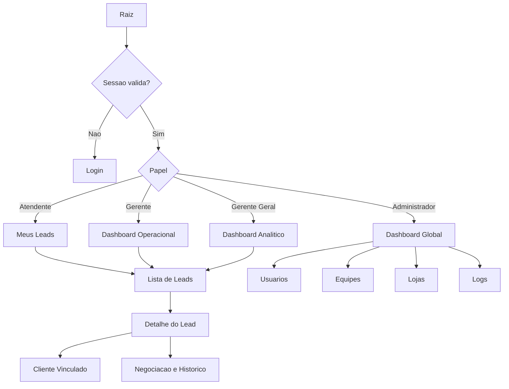
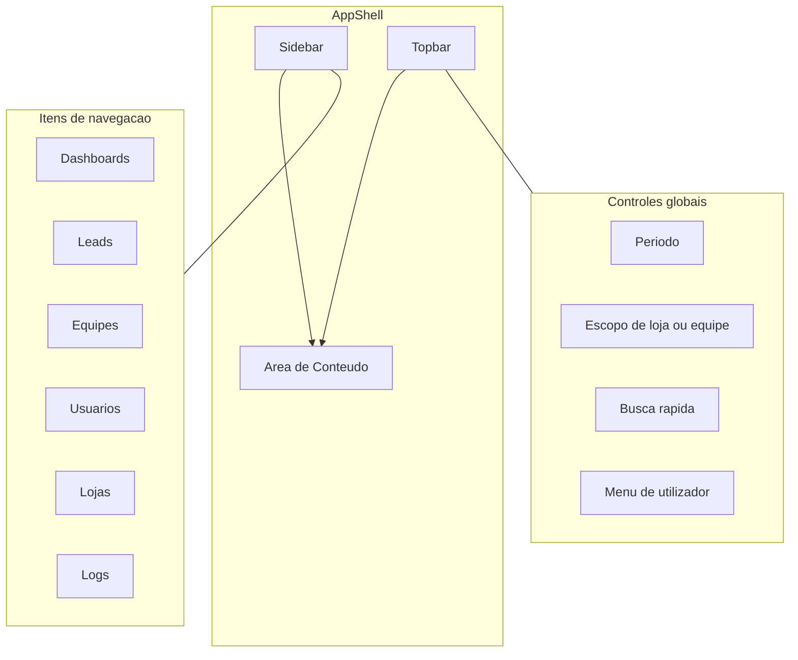
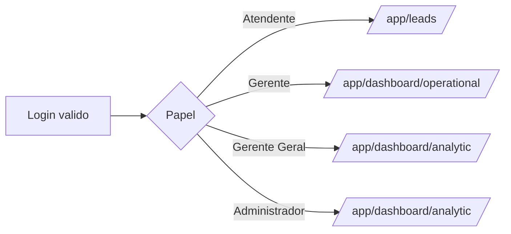
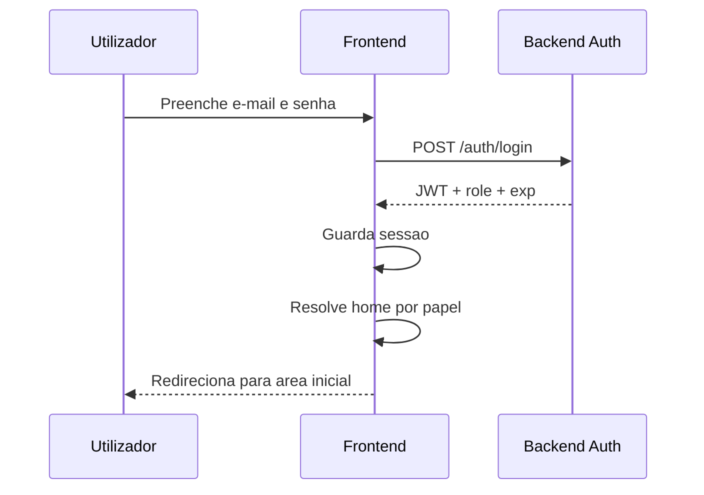
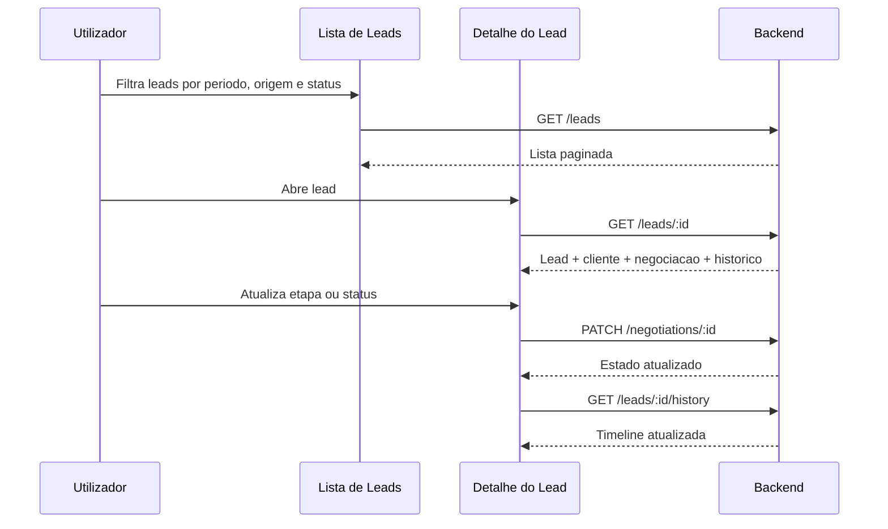
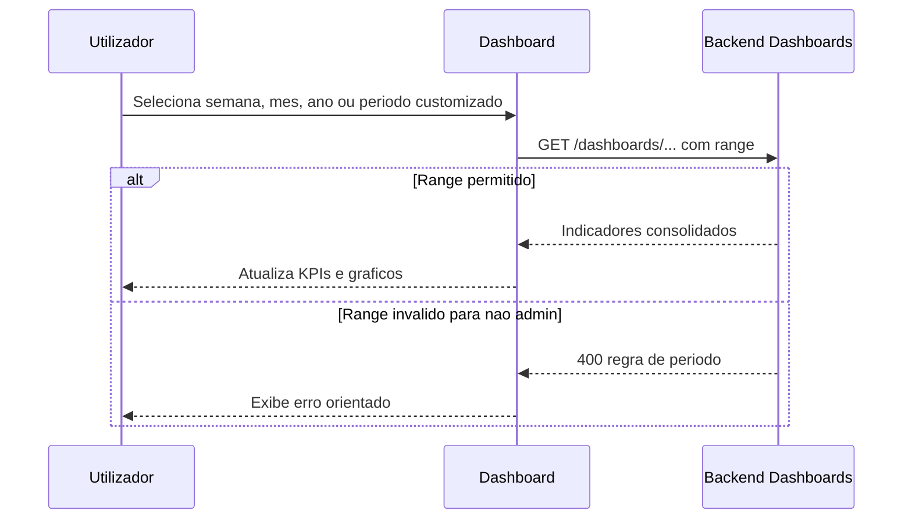
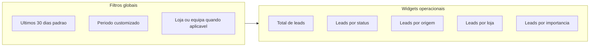
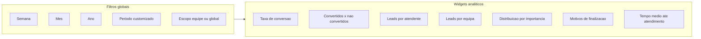
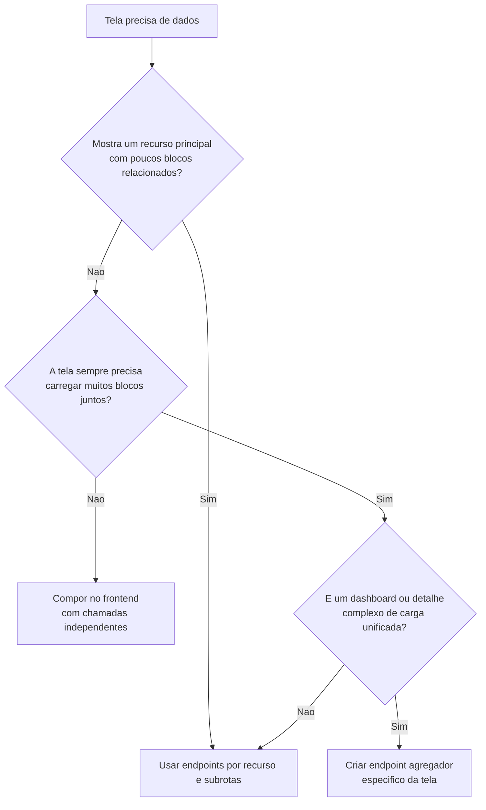

# Frontend - Plano de Implementação, IA e UX

**Versão:** 2.0  
**Data:** 2026-04-06  
**Ramo alvo:** `develop`

## Objetivo

Este documento define como o frontend deve ser planejado, fatiado e implementado pelo time no contexto do ABP **Sistema de Gestão de Leads com Dashboard Analítico**. Ele substitui um guia apenas conceitual por uma referência de execução: telas, rotas, papéis, fluxos, contratos-alvo, prioridades e diagramas Mermaid.

Uso esperado:

- alinhar o time antes de abrir tasks ou histórias técnicas;
- orientar implementação em `front/` sem reabrir o edital a cada decisão;
- validar se uma tela realmente atende `RF01` a `RF07`;
- manter a Wiki sincronizada com uma fonte primária versionada no repositório.

## Leituras obrigatórias em conjunto

- [README.md](../../README.md)
- [docs/architecture/README.md](./README.md)
- [docs/architecture/next-frontend.md](./next-frontend.md)
- [front/README.md](../../front/README.md)

## Premissas e limites

- O produto é uma **aplicação interna autenticada**, não um site institucional.
- O frontend existe para suportar operação comercial, gestão e auditoria.
- `Next.js` continua sendo apenas o framework React adotado para o frontend.
- `RBAC`, regras de negócio, validação de filtros temporais e auditoria são responsabilidade do backend.
- O frontend pode ocultar, desabilitar ou reorganizar ações por papel, mas nunca substituir a autorização do backend.
- Canais como WhatsApp, Instagram e formulário digital entram como **origem do lead**, não como integrações obrigatórias nesta fase.
- A identidade da 1000 Valle pode influenciar cores e tom visual, mas não deve arrastar o time para refatorar o site legado.

## Resultado que o frontend precisa entregar

O frontend deve suportar quatro jornadas principais:

1. acesso ao sistema e manutenção do próprio perfil;
2. operação comercial em leads, clientes e negociação;
3. leitura gerencial de dashboards com filtros temporais;
4. administração de usuários, equipes, lojas e logs conforme papel.

## Princípios de produto e UX

- A navegação principal é um `AppShell` autenticado com `sidebar`, `topbar` e área central por contexto.
- A linguagem visual deve seguir um padrão `shadcn admin/dashboard`: legível, denso quando necessário e sem excesso de ornamentação.
- O sistema deve privilegiar fluxo de trabalho e leitura rápida de informação, não storytelling de marketing.
- O mobile precisa funcionar, mas a prioridade é produtividade em desktop.
- Tabelas e formulários são componentes centrais do produto; gráficos são complementares e devem consumir indicadores prontos da API.
- Estados de loading, vazio, erro e permissão insuficiente são parte do escopo da interface.

## Direção visual

- Referências visuais: `Shadcn UI Kit`, `Shadcn Store`, `shadcnblocks-admin`, `shadcndesign`, `shadcn.io`.
- O HTML legado da 1000 Valle deve ser usado apenas como pista secundária de cor e marca.
- O layout final deve nascer de blocos de dashboard e CRUD, não de clonagem do site institucional.

Paleta-base sugerida para validação com a equipe:

| Token legado | Hex | Uso sugerido |
| --- | --- | --- |
| `--mvl-primary-color` | `#cc6119` | CTA e destaque principal |
| `--mvl-secondary-color` | `#6c98e1` | Links e apoio visual |
| `--motors-accent-color` | `#1280DF` | Foco, filtros e gráficos |
| `--mvl-third-color` | `#232628` | Texto forte e sidebar |
| `--motors-bg-shade` | `#F0F3F7` | Fundo geral |
| `#22BD1F` | `#22BD1F` | Sucesso e conversão |

## Estratégia de navegação

### Decisão principal

A raiz da aplicação deve levar o utilizador para login ou para a área autenticada. A navegação relevante começa **depois** do login.

### Landing por papel

- `Atendente`: destino inicial em `Meus Leads`.
- `Gerente`: destino inicial em `Dashboard Operacional`.
- `Gerente Geral`: destino inicial em `Dashboard Analítico`.
- `Administrador`: destino inicial em `Dashboard Analítico` ou `Dashboard Global`.

### Mapa de alto nível



## Arquitetura da informação

### Áreas da aplicação

| Área | Objetivo | Papéis | Observações |
| --- | --- | --- | --- |
| Autenticação | Login e gestão do próprio acesso | Todos | `RF01` |
| Leads | Operação principal do fluxo comercial | Atendente, Gerente, Admin | Núcleo do sistema |
| Clientes | Cadastro e manutenção de clientes | Atendente, Gerente, Admin | Sempre ligado ao fluxo de lead |
| Negociação | Evolução comercial do lead | Atendente, Gerente, Admin | Uma negociação ativa por lead |
| Dashboard Operacional | Leitura rápida do fluxo corrente | Gerente, Gerente Geral, Admin | `RF04` |
| Dashboard Analítico | Consolidação gerencial e temporal | Gerente, Gerente Geral, Admin | `RF05` e `RF06` |
| Equipes e atendentes | Organização comercial | Gerente, Admin | Gerente vincula; Admin administra |
| Usuários | Gestão administrativa ampla | Admin | `RF02` |
| Lojas | Cadastro e organização estrutural | Admin | Necessário para vínculo do lead |
| Logs | Auditoria | Admin | `RF07` |

### Shell da aplicação



## Rotas-alvo do frontend

As rotas abaixo são o alvo do `App Router`. Elas representam o mapa de implementação, não uma obrigação de concluir tudo na mesma sprint.

| Rota | Objetivo | Papéis | Módulos/API alvo | Prioridade |
| --- | --- | --- | --- | --- |
| `/login` | Autenticação por e-mail e senha | Público | `auth` | Alta |
| `/app` | Redirecionamento por papel | Todos autenticados | `auth`, `users` | Alta |
| `/app/profile` | Atualizar próprio e-mail e senha | Todos | `auth`, `users` | Alta |
| `/app/leads` | Listar e filtrar leads | Atendente, Gerente, Admin | `leads`, `stores`, `teams` | Alta |
| `/app/leads/new` | Criar lead | Atendente, Admin | `leads`, `customers`, `stores`, `users` | Alta |
| `/app/leads/[leadId]` | Visualizar detalhe completo do lead | Atendente, Gerente, Admin | `leads`, `customers`, `negotiations` | Alta |
| `/app/leads/[leadId]/edit` | Editar lead | Atendente, Gerente, Admin | `leads` | Alta |
| `/app/customers` | Listar clientes acessíveis | Atendente, Gerente, Admin | `customers` | Média |
| `/app/customers/[customerId]` | Visualizar ou editar cliente | Atendente, Gerente, Admin | `customers`, `leads` | Média |
| `/app/dashboard/operational` | KPIs operacionais | Gerente, Gerente Geral, Admin | `dashboards` | Alta |
| `/app/dashboard/analytic` | KPIs analíticos | Gerente, Gerente Geral, Admin | `dashboards` | Alta |
| `/app/teams` | Visualizar equipes e vínculos | Gerente, Admin | `teams`, `users` | Média |
| `/app/users` | Gestão administrativa de utilizadores | Admin | `users`, `teams` | Alta |
| `/app/stores` | Gestão de lojas | Admin | `stores` | Média |
| `/app/logs` | Auditoria de acesso e operações | Admin | `audit-logs` | Alta |
| `/403` | Permissão insuficiente | Todos autenticados | N/A | Média |

## Home por papel



## Inventário de telas

| Tela | Objetivo | Dados centrais | Componentes centrais |
| --- | --- | --- | --- |
| Login | Entrar no sistema | e-mail, senha, erro de autenticação | `Card`, `Form`, `Input`, `Button`, `Alert` |
| Perfil | Atualizar credenciais próprias | e-mail atual, senha atual, nova senha | `Tabs`, `Form`, `Toast` |
| Lista de leads | Operação diária | filtros, paginação, origem, status, loja, atendente | `DataTable`, `FiltersBar`, `Badge`, `Pagination` |
| Detalhe do lead | Contexto completo do lead | lead, cliente, loja, atendente, negociação, histórico | `Tabs`, `SummaryCard`, `Timeline`, `Sheet` |
| Formulário de lead | Criar ou editar lead | dados do lead e vínculos | `Form`, `Select`, `Combobox`, `Textarea` |
| Clientes | Consultar e editar cliente | dados cadastrais e vínculos com lead | `DataTable`, `Drawer`, `Form` |
| Dashboard operacional | Monitoramento corrente | total, status, origem, loja, importância | `KpiCards`, `BarChart`, `DonutChart`, `DateRange` |
| Dashboard analítico | Leitura gerencial | conversão, equipe, atendente, motivos, tempo médio | `KpiCards`, `LineChart`, `StackedBar`, `DateRange` |
| Usuários | Gestão administrativa | utilizadores, papéis, equipa, estado | `DataTable`, `Dialog`, `Form` |
| Equipes | Vínculo entre gerente e atendentes | equipa, gerente, atendentes | `SplitView`, `List`, `Dialog` |
| Lojas | Estrutura da empresa | lojas e metadados | `DataTable`, `Form` |
| Logs | Auditoria | evento, data, utilizador, entidade | `DataTable`, `FiltersBar`, `DetailPanel` |

## Matriz de ações por papel

Esta matriz é mais importante do que a simples visibilidade de telas, porque é ela que orienta botões, estados da UI e tratamento de erro `403`.

| Recurso | Atendente | Gerente | Gerente Geral | Admin |
| --- | --- | --- | --- | --- |
| Login | Sim | Sim | Sim | Sim |
| Atualizar próprio perfil | Sim | Sim | Sim | Sim |
| Listar leads | Apenas próprios | Equipe | Global leitura quando API permitir | Global |
| Criar lead | Sim | Não | Não | Sim |
| Editar lead | Próprios | Equipe | Não | Sim |
| Excluir lead | Não | Não | Não | Sim |
| Listar clientes | Dos próprios leads | Da equipe | Não | Global |
| Criar ou editar cliente | Vinculado aos próprios leads | Da equipe | Não | Global |
| Criar negociação | Sim | Sim na equipa | Não | Sim |
| Alterar estágio ou status | Sim | Sim na equipa | Não | Sim |
| Ver histórico da negociação | Sim | Sim | Sim leitura consolidada quando existir | Sim |
| Dashboard operacional | Não | Sim | Sim | Sim |
| Dashboard analítico | Não | Sim equipe | Sim global | Sim global |
| Vincular atendente à equipa | Não | Sim | Não | Sim |
| CRUD de utilizadores | Não | Não | Não | Sim |
| CRUD de equipas | Não | Não | Não | Sim |
| CRUD de lojas | Não | Não | Não | Sim |
| Ver logs | Não | Não | Não | Sim |

## Matriz RF x telas x papéis

| RF | Telas principais | Papéis | Observações de implementação |
| --- | --- | --- | --- |
| `RF01` | `Login`, `Perfil` | Todos | JWT e atualização das próprias credenciais |
| `RF02` | `AppShell`, `Leads`, `Dashboards`, `Users`, `Teams`, `Logs` | Todos | UI espelha RBAC; backend decide |
| `RF03` | `Detalhe do Lead`, `Form de Negociação`, `Histórico` | Atendente, Gerente, Admin | Uma negociação ativa por lead |
| `RF04` | `Dashboard Operacional` | Gerente, Gerente Geral, Admin | Filtro padrão últimos 30 dias |
| `RF05` | `Dashboard Analítico` | Gerente, Gerente Geral, Admin | Indicadores consolidados |
| `RF06` | `Topbar`, `Dashboards`, `Leads` | Gerente, Gerente Geral, Admin | Limite de 1 ano validado no backend |
| `RF07` | `Logs` | Admin | Login e operações auditáveis |

## Fluxos críticos

### Fluxo 1 - autenticação e roteamento inicial



### Fluxo 2 - lead, cliente, negociação e histórico



### Fluxo 3 - dashboards e filtros temporais



## Dashboards

### Dashboard operacional

Objetivo: leitura rápida do estado corrente da operação.

Widgets mínimos:

- total de leads;
- leads por status;
- leads por origem;
- leads por loja;
- leads por importância;
- filtro padrão de últimos 30 dias.



### Dashboard analítico

Objetivo: leitura consolidada de desempenho e conversão.

Widgets mínimos:

- taxa de conversão;
- convertidos x não convertidos;
- leads por atendente;
- leads por equipe;
- distribuição por importância;
- motivos de finalização;
- tempo médio até atendimento.



## Contratos-alvo com a API

Os nomes abaixo são contratos-alvo para guiar frontend e backend em paralelo. A implementação real pode ajustar paths e payloads, mas não deve perder o comportamento descrito.

| Domínio | Contratos mínimos esperados |
| --- | --- |
| `auth` | `POST /auth/login`, `GET /auth/session` (bootstrap opcional), `GET /auth/me` (estrito), `PATCH /auth/me`, `PATCH /auth/me/password` |
| `leads` | `GET /leads`, `POST /leads`, `GET /leads/:id`, `PATCH /leads/:id` |
| `customers` | `GET /customers`, `POST /customers`, `GET /customers/:id`, `PATCH /customers/:id` |
| `negotiations` | `POST /leads/:id/negotiation`, `PATCH /negotiations/:id`, `GET /leads/:id/history` |
| `dashboards` | `GET /dashboards/operational`, `GET /dashboards/analytic` |
| `teams` | `GET /teams`, `PATCH /teams/:id/assignments` |
| `users` | `GET /users`, `POST /users`, `PATCH /users/:id`, `DELETE /users/:id` |
| `stores` | `GET /stores`, `POST /stores`, `PATCH /stores/:id`, `DELETE /stores/:id` |
| `audit-logs` | `GET /audit-logs`, `GET /audit-logs/:id` |

## Estratégia de endpoints por tela

O frontend não deve depender de uma API feita de endpoints gigantes por padrão, nem de uma explosão de chamadas sem critério. A decisão recomendada para o projeto é:

- modelar endpoints separados por recurso e responsabilidade como regra geral;
- compor a tela no frontend quando os blocos forem independentes;
- criar endpoint agregador apenas para telas que sempre precisem de muitos blocos juntos.

### Regra prática

| Tipo de tela | Estratégia recomendada | Exemplo |
| --- | --- | --- |
| Tela simples | Subrotas e recursos separados | `GET /leads`, `GET /customers/:id`, `PATCH /users/:id` |
| Detalhe com poucos relacionamentos | Recurso principal + subrotas específicas | `GET /leads/:id`, `GET /leads/:id/history` |
| Dashboard | Endpoint agregador por tela | `GET /dashboards/operational`, `GET /dashboards/analytic` |
| Tela muito acoplada e sempre carregada em bloco | Endpoint de composição dedicado | futuro `GET /leads/:id/overview`, se realmente necessário |



### Decisão aplicada ao ABP

- `auth`, `users`, `teams`, `stores`, `customers` e `leads` devem seguir orientação por recurso e subrotas.
- `dashboards` já nascem como endpoints agregadores, porque a tela sempre consome indicadores consolidados.
- o detalhe de lead deve começar com recurso principal + subrotas específicas; só deve ganhar um endpoint único de composição se a tela realmente ficar pesada demais para orquestrar.
- a Sprint 1 deve preferir integração real com endpoints existentes, em vez de montar uma camada de mocks como direção principal do produto.

## Organização de implementação no frontend

### Estrutura esperada

```text
front/src/
├── app/
│   ├── (public)/
│   │   └── login/
│   ├── (protected)/
│   │   ├── app/
│   │   │   ├── dashboard/
│   │   │   ├── leads/
│   │   │   ├── customers/
│   │   │   ├── teams/
│   │   │   ├── users/
│   │   │   ├── stores/
│   │   │   ├── logs/
│   │   │   └── profile/
├── components/
│   └── shared/
├── features/
│   ├── auth/
│   ├── dashboards/
│   ├── leads/
│   ├── customers/
│   ├── negotiations/
│   ├── teams/
│   ├── users/
│   ├── stores/
│   └── audit-logs/
└── lib/
```

### Responsabilidades por camada do frontend

| Camada | Responsabilidade |
| --- | --- |
| `app/` | rotas, layouts, composição de página, guards visuais |
| `features/*/api` | chamadas HTTP da feature |
| `features/*/server` | composição server-side quando fizer sentido |
| `features/*/components` | componentes específicos do domínio |
| `components/shared` | UI reutilizável entre domínios |
| `lib/auth` | sessão, helpers de papel e redirecionamento |
| `lib/routes` | mapa central de paths e navegação |

## Plano de implementação por fases

### Fase 1 - base visual e autenticação

- fechar tokens visuais e layout-base;
- implementar `login`, sessão e redirecionamento por papel;
- montar `AppShell`, navegação lateral e menu de utilizador;
- criar tela de `Perfil`.

### Fase 2 - operação comercial

- implementar `Lista de Leads`;
- implementar `Criar Lead` e `Editar Lead`;
- implementar `Detalhe do Lead` com cliente vinculado;
- fechar estados vazios, filtros e paginação.

### Fase 3 - negociação e histórico

- integrar criação e edição de negociação;
- exibir importância, estágio, status e timeline;
- reforçar regra visual de uma negociação ativa por lead;
- definir tratamento de conflito vindo da API.

### Fase 4 - gestão e dashboards

- implementar dashboard operacional;
- implementar dashboard analítico;
- implementar gestão de utilizadores, equipas e lojas;
- implementar logs para administrador.

## Sequência sugerida para as sprints

| Sprint | Entrega de frontend sugerida |
| --- | --- |
| Sprint 1 | Login, sessão, `AppShell`, perfil, base de leads |
| Sprint 2 | Detalhe do lead, cliente, negociação, histórico |
| Sprint 3 | Dashboards, administração, logs, refinamento de responsividade |

## Critérios de pronto para histórias de frontend

- rota funcional no `App Router`;
- estados de loading, vazio, sucesso e erro implementados;
- comportamento coerente para papel sem permissão;
- integração com contrato HTTP explícito;
- componentes reutilizáveis extraídos quando houver repetição;
- texto da UI consistente com o domínio do edital;
- responsividade mínima validada em desktop e mobile;
- documentação atualizada se a rota ou o fluxo mudar.

## Riscos e decisões abertas

- O sistema ainda precisa de uma convenção formal de nomes para estágio e status de negociação.
- A granularidade exata do `Gerente Geral` em telas operacionais depende do contrato final da API.
- A decisão entre composição por recurso e endpoint agregador deve ser registrada por tela antes de estabilizar os contratos do frontend.
- Kanban é opcional. Se entrar, deve ser uma visualização alternativa de leads ou negociação, nunca substituto do fluxo exigido pelo edital.

## Entregáveis documentais derivados deste plano

- wireframes de baixa fidelidade das telas críticas;
- tabela final de rotas e contratos confirmados com o backend;
- inventário de componentes compartilhados;
- catálogo visual do dashboard operacional e analítico;
- checklist final `RF01` a `RF07` por tela antes de homologação interna.

## Histórico de revisões

| Data | Nota |
| --- | --- |
| 2026-04-06 | Reescrita do documento para formato de implementação do time, com rotas, matriz de ações, contratos-alvo e novos diagramas Mermaid. |
