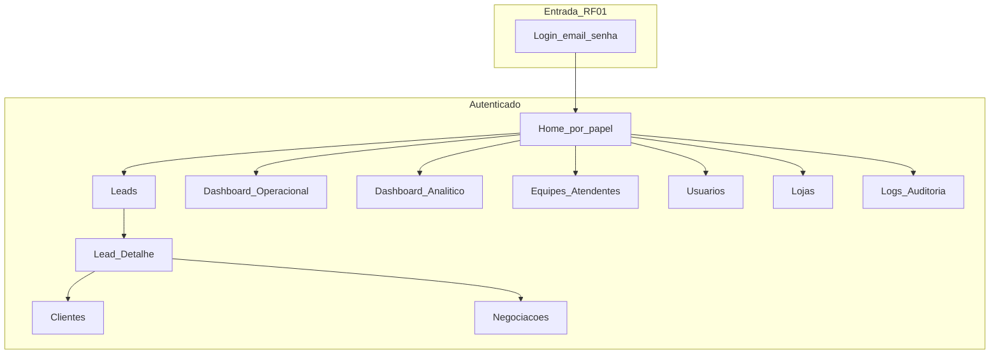
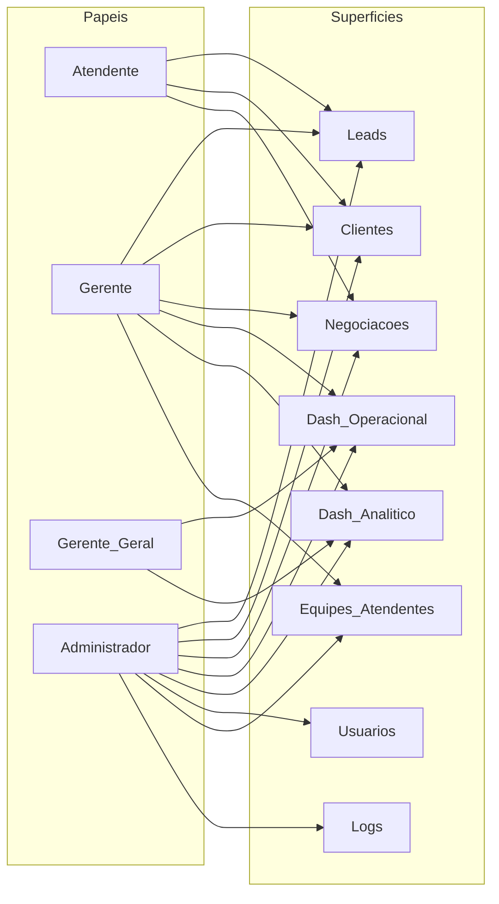
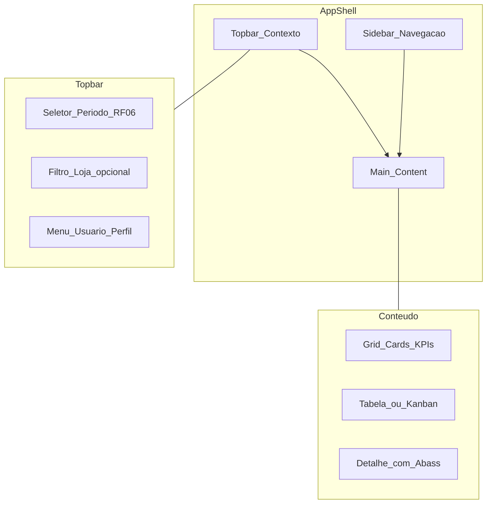
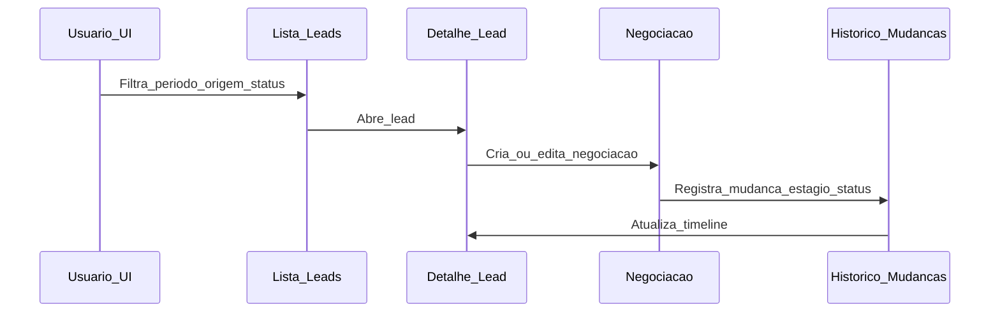
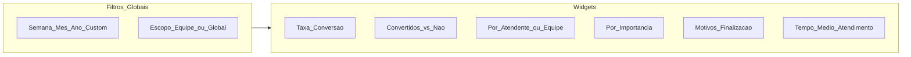

# Frontend — Arquitetura da Informação (IA), UX e plano de implementação

**Versão:** 1.0 · **Data:** 2026-04-06 · **Ramo alvo:** `develop`

**Glossário:** neste documento, **IA** = *Arquitetura da Informação* (organização de áreas, navegação e conteúdos da app), **não** Inteligência Artificial.

## Objetivo

Consolidar o mapa de navegação, escopo de telas, princípios de UX e referências visuais (shadcn / identidade Valle) para guiar a implementação do frontend no escopo do edital **Sistema de Gestão de Leads com Dashboard Analítico** (RF01–RF07 e RNFs aplicáveis à UI). Este ficheiro é a **fonte de verdade** para priorização de rotas e shells; a Wiki do projeto deve espelhar o mesmo conteúdo (ver [`../wiki/README.md`](../wiki/README.md)).

## Contexto do repositório

- Stack em [`../../front/README.md`](../../front/README.md): **Next.js (App Router)** sobre **React** — UI em **`.tsx`** (TypeScript), Tailwind 4 e shadcn/ui. Atende ao **RP01** (*Frontend: React com TypeScript*).
- Estrutura modular em `front/src/features/` (leads, deals, customers, users, teams, stores, audit-logs, landing, login); o App Router em `front/src/app/` pode permanecer mínimo até as rotas serem criadas conforme este plano.
- **Regra de ouro do edital:** RBAC e validação de período são **somente no backend** (`back/`); o frontend **reflete** permissões (ocultar/desabilitar) e trata erros 403 — nunca como única barreira de segurança.

## Delimitação do escopo (edital)

- **Dentro do escopo (frontend):** fluxo autenticado para leads, clientes, negociações (RF03), loja/atendente/equipe, dashboard operacional (RF04), dashboard analítico (RF05), filtros temporais na UI (RF06), perfil e-mail/senha (RF01), administração conforme RBAC (RF02), logs só Administrador (RF07). Cores/logo Valle no login/shell são **opcionais**, não requisito explícito.
- **Fora do escopo:** site institucional, landing de marketing, refatoração do site da 1000 Valle. Canais do desafio (WhatsApp, Instagram, etc.) = **origem do lead** (dados/filtros), não vitrines ou integrações extra salvo API + RFs.
- **Consequência:** navegação principal **após login** (shell tipo dashboard); raiz pode redirecionar para login.

## Natureza do produto

Sistema no edital: *Sistema de Gestão de Leads com Dashboard Analítico*. Equivale a um **CRM operacional** (leads, pipeline, histórico, indicadores, auditoria), **sem** marketing automation, e-mail marketing, CTI, etc. Linguagem de UI alinhada ao edital; padrão visual **app interna** (tabelas, filtros, KPIs), inspirado em templates shadcn admin/dashboard.

## Princípios de UX

- **Valor:** (1) operação — leads, clientes, negociação, histórico; (2) gestão — RF04 + RF05 + RF06.
- **Visual:** sidebar colapsável, topbar (período / loja / utilizador), cards e data tables; gráficos discretos nos analíticos.
- **RNF04:** sidebar → sheet em mobile; tabelas com scroll ou vista compacta; filtros em popover/drawer.
- **Feedback:** vazios, skeleton, toasts; erros de API legíveis.

## Identidade Valle (apenas cor, opcional)

- Export HTML na raiz do repositório (nome variável) contém tema **Motors** — usar **só** tokens de cor do `:root`, não layout legado.
- Paleta de referência (mapear depois para tokens shadcn):

| Token legado (Motors/MVL) | Hex | Uso sugerido |
| --- | --- | --- |
| `--mvl-primary-color` | `#cc6119` | Primária |
| `--mvl-secondary-color` | `#6c98e1` | Secundária |
| `--mvl-secondary-color-dark` | `#5a7db6` | Hover secundário |
| `--motors-accent-color` | `#1280DF` | Acento |
| `--mvl-third-color` | `#232628` | Texto / sidebar |
| `--mvl-fourth-color` | `#153e4d` | Superfície escura alt. |
| Top bar tema | `#314362` | Shell (opcional) |
| `--motors-bg-shade` | `#F0F3F7` | Fundo |
| `--motors-bg-contrast` | `#35475A` | Contraste |
| “Sucesso” tema | ≈ `#22BD1F` | Semântica sucesso (validar) |

## Arquitetura de informação (áreas)

| Área | Público | Conteúdo |
| --- | --- | --- |
| Autenticação e perfil (RF01) | Todos | Login; JWT; raiz → login; perfil (e-mail/senha próprios); recuperação só se API existir |
| Operação — Leads | Atendente, Gerente, Admin | Lista, detalhe, CRUD conforme papel; loja/atendente |
| Operação — Clientes | Conforme RF02 | CRUD conforme papel |
| Operação — Negociações | Conforme RF02 | Deal por lead; importância; estágio/status; histórico; uma ativa (RF03) |
| Dashboard operacional | Gerente, Gerente Geral, Admin | RF04; padrão 30 dias |
| Dashboard analítico | Gerente, Gerente Geral, Admin | RF05; RF06; erro se período > 1 ano (não-admin) |
| Equipes / utilizadores / lojas | Gerente (vincular), Admin | Conforme matriz |
| Logs | Só Admin | RF07 |

**Atendente:** sem dashboards consolidados de equipa (foco nos próprios leads). **Gerente Geral:** leitura global, sem CRUD operacional. **Admin:** CRUD amplo + logs.

## Referências shadcn (catálogo, não código)

Shadcn UI Kit, Shadcn Store (dashboard), shadcnblocks-admin, shadcndesign — priorizar tabelas, formulários, date range, cards KPI (RF04–RF06). Kanban = variação de UI opcional se RF03 continuar garantido.

## Diagramas Mermaid

### 1) Mapa de alto nível

### 2) Visibilidade por papel (UI espelha backend)

### 3) App shell

### 4) Jornada lead → negociação → histórico

### 5) Dashboard analítico (RF05)

## Checklist de implementação (próximos passos)

1. Documentar tokens Valle + wireframes de baixa das telas críticas.
2. Matriz RF01–RF07 × tela × papel.
3. Tabela de rotas-alvo (path, papel mínimo, APIs, componentes).
4. Implementar: blocos shadcn, `AppShell`, rotas por papel, integração com API.

## Riscos e decisões

- **Paleta:** validar com parceiro/banca; HTML legado só como pista.
- **Stack:** declarar na documentação *React + TypeScript (.tsx); Next.js como framework React*.
- **Kanban:** opcional; não violar RF03 (histórico, uma negociação ativa).

## Histórico de revisões

| Data | Nota |
| --- | --- |
| 2026-04-06 | Versão inicial versionada em `docs/architecture/` para guiar implementação em `develop`. |
