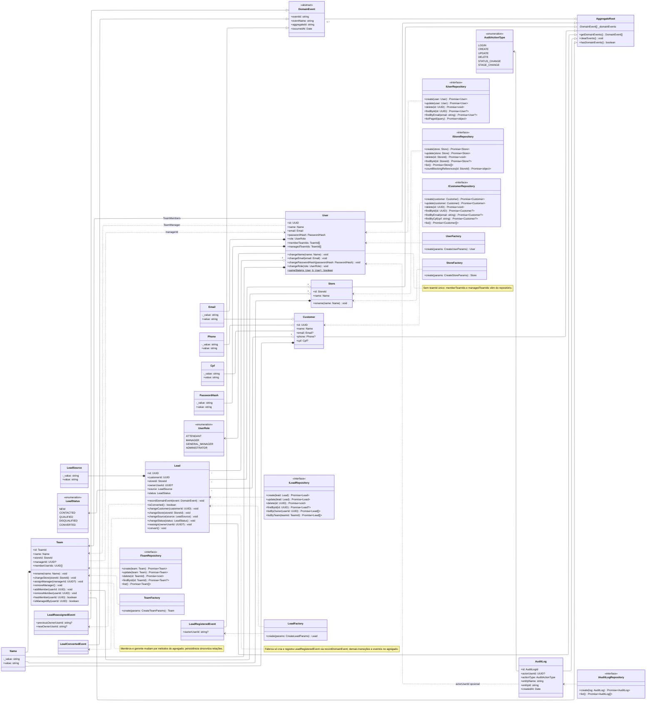

```mermaid

---
config:
  layout: elk
---
classDiagram
direction RL

class AggregateRoot {
  -DomainEvent[] _domainEvents
  +getDomainEvents() DomainEvent[]
  +clearEvents() void
  +hasDomainEvents() boolean
}

class DomainEvent {
  <<abstract>>
  +eventId: string
  +eventName: string
  +aggregateId: string
  +occurredAt: Date
}

class Name {
  -_value: string
  +value: string
}

class Email {
  -_value: string
  +value: string
}

class Phone {
  -_value: string
  +value: string
}

class Cpf {
  -_value: string
  +value: string
}

class PasswordHash {
  -_value: string
  +value: string
}

class LeadSource {
  -_value: string
  +value: string
}

class UserRole {
  <<enumeration>>
  ATTENDANT
  MANAGER
  GENERAL_MANAGER
  ADMINISTRATOR
}

class LeadStatus {
  <<enumeration>>
  NEW
  CONTACTED
  QUALIFIED
  DISQUALIFIED
  CONVERTED
}

class AuditActionType {
  <<enumeration>>
  LOGIN
  CREATE
  UPDATE
  DELETE
  STATUS_CHANGE
  STAGE_CHANGE
}

class User {
  +id: UUID
  +name: Name
  +email: Email
  +passwordHash: PasswordHash
  +role: UserRole
  +memberTeamIds: TeamId[]
  +managedTeamIds: TeamId[]
  +changeName(name: Name) void
  +changeEmail(email: Email) void
  +changePasswordHash(passwordHash: PasswordHash) void
  +changeRole(role: UserRole) void
  +sameState(a: User, b: User)$ boolean
}

class Team {
  +id: TeamId
  +name: Name
  +storeId: StoreId
  +managerId: UUID?
  +memberUserIds: UUID[]
  +rename(name: Name) void
  +changeStore(storeId: StoreId) void
  +assignManager(managerId: UUID?) void
  +removeManager() void
  +addMember(userId: UUID) void
  +removeMember(userId: UUID) void
  +hasMember(userId: UUID) boolean
  +isManagedBy(userId: UUID) boolean
}

class Store {
  +id: StoreId
  +name: Name
  +rename(name: Name) void
}

class Customer {
  +id: UUID
  +name: Name
  +email: Email?
  +phone: Phone?
  +cpf: Cpf?
}

class Lead {
  +id: UUID
  +customerId: UUID
  +storeId: StoreId
  +ownerUserId: UUID?
  +source: LeadSource
  +status: LeadStatus
  +recordDomainEvent(event: DomainEvent) void
  +isConverted() boolean
  +changeCustomer(customerId: UUID) void
  +changeStore(storeId: StoreId) void
  +changeSource(source: LeadSource) void
  +changeStatus(status: LeadStatus) void
  +reassign(ownerUserId: UUID?) void
  +convert() void
}

class AuditLog {
  +id: AuditLogId
  +actorUserId: UUID?
  +actionType: AuditActionType
  +entityName: string
  +entityId: string
  +createdAt: Date
}

class IUserRepository {
  <<interface>>
  +create(user: User) Promise~User~
  +update(user: User) Promise~User~
  +delete(id: UUID) Promise~void~
  +findById(id: UUID) Promise~User?~
  +findByEmail(email: string) Promise~User?~
  +listPaged(query) Promise~object~
}

class ITeamRepository {
  <<interface>>
  +create(team: Team) Promise~Team~
  +update(team: Team) Promise~Team~
  +delete(id: TeamId) Promise~void~
  +findById(id: TeamId) Promise~Team?~
  +list() Promise~Team[]~
}

class IStoreRepository {
  <<interface>>
  +create(store: Store) Promise~Store~
  +update(store: Store) Promise~Store~
  +delete(id: StoreId) Promise~void~
  +findById(id: StoreId) Promise~Store?~
  +list() Promise~Store[]~
  +countBlockingReferences(id: StoreId) Promise~object~
}

class ICustomerRepository {
  <<interface>>
  +create(customer: Customer) Promise~Customer~
  +update(customer: Customer) Promise~Customer~
  +delete(id: UUID) Promise~void~
  +findById(id: UUID) Promise~Customer?~
  +findByEmail(email: string) Promise~Customer?~
  +findByCpf(cpf: string) Promise~Customer?~
  +list() Promise~Customer[]~
}

class ILeadRepository {
  <<interface>>
  +create(lead: Lead) Promise~Lead~
  +update(lead: Lead) Promise~Lead~
  +delete(id: UUID) Promise~void~
  +findById(id: UUID) Promise~Lead?~
  +listByOwner(userId: UUID) Promise~Lead[]~
  +listByTeam(teamId: TeamId) Promise~Lead[]~
}

class IAuditLogRepository {
  <<interface>>
  +create(log: AuditLog) Promise~AuditLog~
  +list() Promise~AuditLog[]~
}

class LeadFactory {
  +create(params: CreateLeadParams) Lead
}

class UserFactory {
  +create(params: CreateUserParams) User
}

class TeamFactory {
  +create(params: CreateTeamParams) Team
}

class StoreFactory {
  +create(params: CreateStoreParams) Store
}

class LeadRegisteredEvent {
  +ownerUserId: string?
}

class LeadReassignedEvent {
  +previousOwnerUserId: string?
  +newOwnerUserId: string?
}

class LeadConvertedEvent

IUserRepository ..> User
ITeamRepository ..> Team
IStoreRepository ..> Store
ICustomerRepository ..> Customer
ILeadRepository ..> Lead
IAuditLogRepository ..> AuditLog

AggregateRoot <|-- User
AggregateRoot <|-- Team
AggregateRoot <|-- Store
AggregateRoot <|-- Customer
AggregateRoot <|-- Lead
AggregateRoot <|-- AuditLog

AggregateRoot o-- "0..*" DomainEvent

DomainEvent <|-- LeadRegisteredEvent
DomainEvent <|-- LeadReassignedEvent
DomainEvent <|-- LeadConvertedEvent

User *-- Name
User *-- Email
User *-- PasswordHash
User --> UserRole

Team *-- Name
Store *-- Name

Customer *-- Name
Customer o-- Email
Customer o-- Phone
Customer o-- Cpf

Lead *-- LeadSource
Lead --> LeadStatus

AuditLog --> AuditActionType
AuditLog ..> User : actorUserId opcional

LeadFactory ..> Lead
LeadFactory ..> LeadRegisteredEvent
UserFactory ..> User
TeamFactory ..> Team
StoreFactory ..> Store

Lead ..> LeadReassignedEvent
Lead ..> LeadConvertedEvent

Store "1" o-- "*" Team
Store "1" o-- "*" Lead
Customer "1" o-- "*" Lead
User "1" o-- "*" Lead
User --> Team : TeamMembers
User ..> Team : TeamManager
Team ..> User : managerId

note for Lead "Fábrica só cria e registra LeadRegisteredEvent via recordDomainEvent; demais transições e eventos no agregado."
note for Team "Membros e gerente mudam por métodos do agregado; persistência sincroniza relações."
note for User "Sem teamId único: memberTeamIds e managedTeamIds vêm do repositório."
```
