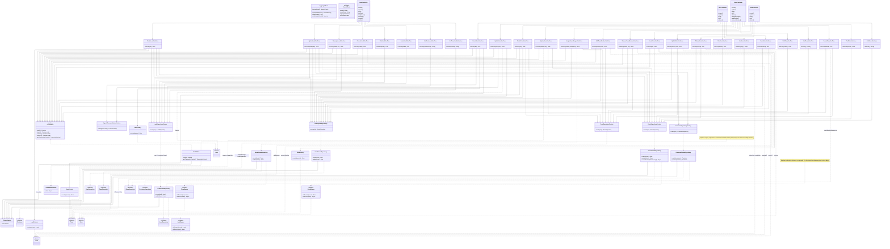

```mermaid

---
config:
  layout: elk
---
classDiagram
direction TB

class AggregateRoot {
  -DomainEvent[] _domainEvents
  +getDomainEvents() DomainEvent[]
  +clearEvents() void
  +hasDomainEvents() boolean
}

class DomainEvent {
  <<abstract>>
  +eventId: string
  +eventName: string
  +aggregateId: string
  +occurredAt: Date
}

class IUnitOfWork {
  <<interface>>
  +run(fn) Promise
  +begin() Promise~void~
  +commit() Promise~void~
  +rollback() Promise~void~
  +getTransactionContext() TransactionContext
}

class TransactionContext {
  +client: object
}

class UnitOfWork {
  +run(fn) Promise
  +getTransactionContext() TransactionContext
}

class PrismaService {
  +client Prisma
}

class Argon2PasswordHasherService {
  +hash(plain: string) Promise~string~
}

class LeadController {
  +create() 
  +update()
  +find()
  +listOwn()
  +listByTeam()
  +reassign()
  +convert()
  +delete()
}

class UserController {
  +create()
  +update()
  +find()
  +list()
  +delete()
}

class TeamController {
  +create()
  +update()
  +find()
  +list()
  +delete()
  +assignManager()
  +addMember()
  +removeMember()
}

class StoreController {
  +create()
  +update()
  +find()
  +list()
  +delete()
}

class Customer {
  <<domain>>
}

class CreateLeadUseCase {
  +execute(dto) Lead
}

class UpdateLeadUseCase {
  +execute(leadId, dto) Lead
}

class ReassignLeadUseCase {
  +execute(leadId, dto) Lead
}

class ConvertLeadUseCase {
  +execute(leadId) Lead
}

class FindLeadUseCase {
  +execute(leadId) Lead
}

class DeleteLeadUseCase {
  +execute(leadId) void
}

class ListOwnLeadsUseCase {
  +execute(ownerUserId) Lead[]
}

class ListTeamLeadsUseCase {
  +execute(teamId) Lead[]
}

class CreateUserUseCase {
  +execute(dto) User
}

class UpdateUserUseCase {
  +execute(userId, dto) User
}

class CreateTeamUseCase {
  +execute(dto) Team
}

class UpdateTeamUseCase {
  +execute(teamId, dto) Team
}

class AssignTeamManagerUseCase {
  +execute(teamId, managerId) Team
}

class AddTeamMemberUseCase {
  +execute(teamId, dto) Team
}

class RemoveTeamMemberUseCase {
  +execute(teamId, dto) Team
}

class CreateStoreUseCase {
  +execute(dto) Store
}

class UpdateStoreUseCase {
  +execute(storeId, dto) Store
}

class DeleteStoreUseCase {
  +execute(storeId) void
}

class FindUserUseCase {
  +execute(userId) User
}

class ListUsersUseCase {
  +execute(query) object
}

class DeleteUserUseCase {
  +execute(userId) void
}

class FindTeamUseCase {
  +execute(teamId) Team
}

class ListTeamsUseCase {
  +execute() Team[]
}

class DeleteTeamUseCase {
  +execute(teamId) void
}

class FindStoreUseCase {
  +execute(storeId) Store
}

class ListStoresUseCase {
  +execute() Store[]
}

class LeadFactory {
  +create(params) Lead
}

class UserFactory {
  +create(params) User
}

class TeamFactory {
  +create(params) Team
}

class StoreFactory {
  +create(params) Store
}

class Lead {
  <<domain>>
}

class User {
  <<domain>>
}

class Team {
  <<domain>>
}

class Store {
  <<domain>>
}

class IUserRepository {
  <<interface>>
}

class ITeamRepository {
  <<interface>>
}

class IStoreRepository {
  <<interface>>
}

class ICustomerRepository {
  <<interface>>
}

class ILeadRepository {
  <<interface>>
}

class LeadRepositoryFactory {
  +create(ctx) ILeadRepository
}

class UserRepositoryFactory {
  +create(ctx) IUserRepository
}

class TeamRepositoryFactory {
  +create(ctx) ITeamRepository
}

class StoreRepositoryFactory {
  +create(ctx) IStoreRepository
}

class CustomerRepositoryFactory {
  +create(ctx) ICustomerRepository
}

class LeadPrismaRepository {
  +create(lead) Lead
  +update(lead) Lead
}

class UserPrismaRepository {
  +create(user) User
  +update(user) User
}

class TeamPrismaRepository {
  +create(team) Team
  +update(team) Team
}

class StorePrismaRepository {
  +create(store) Store
  +update(store) Store
  +countBlockingReferences(id) object
}

class CustomerPrismaRepository {
  +create(customer) Customer
  +update(customer) Customer
}

class LeadMapper {
  <<mapper>>
  +toDomain(record) Lead
  +toRecord(lead) object
}

class TeamMapper {
  <<mapper>>
  +toDomain(row) Team
  +toRecord(team) object
}

class StoreMapper {
  <<mapper>>
  +toDomain(record) Store
  +toRecord(store) object
}

IUnitOfWork <|.. UnitOfWork
UnitOfWork --> PrismaService : transações
UnitOfWork ..> TransactionContext

LeadController --> CreateLeadUseCase
LeadController --> UpdateLeadUseCase
LeadController --> ReassignLeadUseCase
LeadController --> ConvertLeadUseCase
LeadController --> FindLeadUseCase
LeadController --> DeleteLeadUseCase
LeadController --> ListOwnLeadsUseCase
LeadController --> ListTeamLeadsUseCase

UserController --> CreateUserUseCase
UserController --> UpdateUserUseCase
UserController --> FindUserUseCase
UserController --> ListUsersUseCase
UserController --> DeleteUserUseCase

TeamController --> CreateTeamUseCase
TeamController --> UpdateTeamUseCase
TeamController --> AssignTeamManagerUseCase
TeamController --> AddTeamMemberUseCase
TeamController --> RemoveTeamMemberUseCase
TeamController --> FindTeamUseCase
TeamController --> ListTeamsUseCase
TeamController --> DeleteTeamUseCase

StoreController --> CreateStoreUseCase
StoreController --> UpdateStoreUseCase
StoreController --> DeleteStoreUseCase
StoreController --> FindStoreUseCase
StoreController --> ListStoresUseCase

CreateLeadUseCase --> IUnitOfWork
CreateLeadUseCase --> LeadFactory
CreateLeadUseCase --> LeadRepositoryFactory
CreateLeadUseCase --> UserRepositoryFactory
CreateLeadUseCase --> CustomerRepositoryFactory
CreateLeadUseCase --> StoreRepositoryFactory

UpdateLeadUseCase --> IUnitOfWork
UpdateLeadUseCase --> LeadRepositoryFactory
UpdateLeadUseCase --> UserRepositoryFactory
UpdateLeadUseCase --> CustomerRepositoryFactory
UpdateLeadUseCase --> StoreRepositoryFactory
UpdateLeadUseCase ..> Lead : mutações na entidade

ReassignLeadUseCase --> IUnitOfWork
ReassignLeadUseCase --> LeadRepositoryFactory
ReassignLeadUseCase --> UserRepositoryFactory
ReassignLeadUseCase ..> Lead : reassign()

ConvertLeadUseCase --> IUnitOfWork
ConvertLeadUseCase --> LeadRepositoryFactory
ConvertLeadUseCase ..> Lead : convert()

FindLeadUseCase --> LeadRepositoryFactory
DeleteLeadUseCase --> LeadRepositoryFactory
ListOwnLeadsUseCase --> LeadRepositoryFactory
ListTeamLeadsUseCase --> LeadRepositoryFactory

FindUserUseCase --> UserRepositoryFactory
ListUsersUseCase --> UserRepositoryFactory
DeleteUserUseCase --> IUnitOfWork
DeleteUserUseCase --> UserRepositoryFactory

FindTeamUseCase --> TeamRepositoryFactory
ListTeamsUseCase --> TeamRepositoryFactory
DeleteTeamUseCase --> IUnitOfWork
DeleteTeamUseCase --> TeamRepositoryFactory

FindStoreUseCase --> StoreRepositoryFactory
ListStoresUseCase --> StoreRepositoryFactory

CreateUserUseCase --> IUnitOfWork
CreateUserUseCase --> UserFactory
CreateUserUseCase --> UserRepositoryFactory
CreateUserUseCase --> Argon2PasswordHasherService

UpdateUserUseCase --> IUnitOfWork
UpdateUserUseCase --> UserRepositoryFactory
UpdateUserUseCase --> Argon2PasswordHasherService
UpdateUserUseCase ..> User : change*

CreateTeamUseCase --> IUnitOfWork
CreateTeamUseCase --> TeamFactory
CreateTeamUseCase --> TeamRepositoryFactory
CreateTeamUseCase --> StoreRepositoryFactory
CreateTeamUseCase --> UserRepositoryFactory

UpdateTeamUseCase --> IUnitOfWork
UpdateTeamUseCase --> TeamRepositoryFactory
UpdateTeamUseCase --> StoreRepositoryFactory
UpdateTeamUseCase ..> Team : rename changeStore

AssignTeamManagerUseCase --> IUnitOfWork
AssignTeamManagerUseCase --> TeamRepositoryFactory
AssignTeamManagerUseCase --> UserRepositoryFactory
AssignTeamManagerUseCase ..> Team : assignManager removeManager

AddTeamMemberUseCase --> IUnitOfWork
AddTeamMemberUseCase --> TeamRepositoryFactory
AddTeamMemberUseCase --> UserRepositoryFactory
AddTeamMemberUseCase ..> Team : addMember

RemoveTeamMemberUseCase --> IUnitOfWork
RemoveTeamMemberUseCase --> TeamRepositoryFactory
RemoveTeamMemberUseCase --> UserRepositoryFactory
RemoveTeamMemberUseCase ..> Team : removeMember

CreateStoreUseCase --> IUnitOfWork
CreateStoreUseCase --> StoreFactory
CreateStoreUseCase --> StoreRepositoryFactory

UpdateStoreUseCase --> IUnitOfWork
UpdateStoreUseCase --> StoreRepositoryFactory
UpdateStoreUseCase ..> Store : rename

DeleteStoreUseCase --> IUnitOfWork
DeleteStoreUseCase --> StoreRepositoryFactory
DeleteStoreUseCase ..> IStoreRepository : countBlockingReferences

LeadRepositoryFactory ..> LeadPrismaRepository : com TransactionContext
UserRepositoryFactory ..> UserPrismaRepository
TeamRepositoryFactory ..> TeamPrismaRepository
StoreRepositoryFactory ..> StorePrismaRepository
CustomerRepositoryFactory ..> CustomerPrismaRepository

LeadPrismaRepository ..|> ILeadRepository
UserPrismaRepository ..|> IUserRepository
TeamPrismaRepository ..|> ITeamRepository
StorePrismaRepository ..|> IStoreRepository
CustomerPrismaRepository ..|> ICustomerRepository

LeadPrismaRepository --> PrismaService
LeadPrismaRepository ..> LeadMapper
UserPrismaRepository --> PrismaService
TeamPrismaRepository --> PrismaService
TeamPrismaRepository ..> TeamMapper
StorePrismaRepository --> PrismaService
StorePrismaRepository ..> StoreMapper
CustomerPrismaRepository --> PrismaService
CustomerPrismaRepository ..> Customer : toDomain inline

LeadMapper ..> Lead
TeamMapper ..> Team
StoreMapper ..> Store

LeadFactory ..> Lead
UserFactory ..> User
TeamFactory ..> Team
StoreFactory ..> Store

note for UnitOfWork "Request-scoped; repositórios recebem TransactionContext para participar da mesma transação Prisma."
note for LeadPrismaRepository "Eventos de domínio coletados no agregado; não há dispatcher/outbox acoplado neste código."
```
